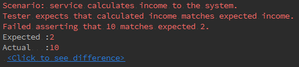

# PHPUnit Tester

BDD style tester for PHPUnit that allows to writes test in readable format. Goal of this library is to introduce "Tester" role to PHPUnit tests. Tester is responsible for verification of correct results so any asserts being made by tester and not by test. To achieve the goal of a readable tests all of the assertions being build by tester as as chained method calls with a readable self explained method names. Example:

```php
public function testCalculateIncome() {
        $tester = $this->tester;
        $service = new IncomeService();
        $tester->checksScenario('service calculates income to the system.')
            ->expectsThat('calculated income matches expected income.')
            ->valueOf($service->calculateIncome())
            ->isEqualTo(self::EXPECTED_INCOME);
}
```

Tester also decorates errors output so, for example, if "IncomeService" service from example above will incorrectly calculate income the error output will include following message(example of output in PHPStorm):



## Package information

Latest Stable Version |  Latest Unstable Version | Total Downloads | Monthly Downloads | Licensing 
--------------------- |  ----------------------- |  -------------- | ----------------  |--------- 
[](https://packagist.org/packages/dekeysoft/pu-tester) | [](https://packagist.org/packages/dekeysoft/pu-tester) | [](https://packagist.org/packages/dekeysoft/pu-tester) | [](https://packagist.org/packages/dekeysoft/pu-tester) | [](https://github.com/dekeysoft/pu-tester/blob/master/LICENSE)

## Requirements

**`PHP >= 5.6.0` is required.**

**`PHPUnit >= 5.6.0` is required.**

## Getting Started

Run the following command to add PHPUnit Tester to your project's `composer.json`. See [Packagist](https://packagist.org/packages/dekeysoft/pu-tester) for specific versions.

```bash
composer require dekeysoft/pu-tester
```

Or you can copy this library from:
- [Packagist](https://packagist.org/packages/dekeysoft/pu-tester)
- [Github](https://github.com/dekeysoft/pu-tester)

Then you can use PHPUnit Tester in your test simply by using "TesterInitialization" trait in your test case. Example:
```php
use PHPUnit\Framework\TestCase;
use DeKey\Tester\TesterInitialization;

class YourTestCase extends TestCase {
    use TesterInitialization;

    public function testSomeMethod() {
        $tester = $this->tester;
        ......
    }
}
```

For additional information and guides go to the [project documentation](docs/README.md)

## Build status

CI status    | Code coverage | Code quality
------------ | ------------- | ------------
[](https://travis-ci.org/dekeysoft/pu-tester) | [](https://coveralls.io/github/dekeysoft/pu-tester?branch=master) | [](https://scrutinizer-ci.com/g/dekeysoft/pu-tester/?branch=master)
