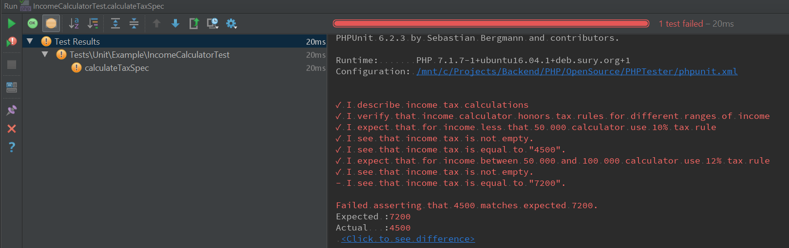

# Code Specs

Code Specs ia a PHPUnit plugin for BDD style Unit tests that allows to writes test in a specification way using human-readable format. 
Goal of this module is to add a bunch of cool methods for unit testing and show a way of representing unit tests as a behavior specifications of a specific class and a test of specific method as a specification of the method.
Tester represents an actor who test you code(yes, like in [Codeception](https://github.com/Codeception/Codeception) - because of Codeception this library exists). See by yourself:
```php
use PHPKitchen\CodeSpecs\Specification\Specification;

/**
 * Specification of {@link IncomeCalculator}
 * 
 * @author Dmitry Kolodko <prowwid@gmail.com>
 */
class IncomeCalculatorTest extends Specification {
    private const EXPECTED_TAX_FOR_FIRST_LEVEL_TAX_RULE = 4500;
    private const EXPECTED_TAX_FOR_SECOND_LEVEL_TAX_RULE = 7200;
    private const EXPECTED_TAX_FOR_THIRD_LEVEL_TAX_RULE = 30000;

    /**
     * @test
     */
    public function calculateTaxSpec() {
        $clientsPayments = [];
        $hoursSpentWorking = 160;
        $service = new IncomeCalculator($clientsPayments, $hoursSpentWorking);
        $I = $this->tester;
        $I->describe('income tax calculations');

        $I->verifyThat('income calculator honors tax rules for different ranges of income');

        $I->expectThat('for income less that 50 000 calculator use 10% tax rule');
        $I->seeThatNumber('income tax', $service->calculateTax())
            ->isNotEmpty()
            ->isEqualTo(self::EXPECTED_TAX_FOR_FIRST_LEVEL_TAX_RULE);

        $I->expectThat('for income between 50 000 and 100 000 calculator use 12% tax rule');
        $I->seeThatNumber('income tax', $service->calculateTax())
            ->isNotEmpty()
            ->isEqualTo(self::EXPECTED_TAX_FOR_SECOND_LEVEL_TAX_RULE);

        $I->expectThat('for income more than 100 000 calculator use 20% tax rule');
        $I->seeThatNumber('income tax', $service->calculateTax())
            ->isNotEmpty()
            ->isEqualTo(self::EXPECTED_TAX_FOR_THIRD_LEVEL_TAX_RULE);
    }
}
```

Code Specs also decorates errors output so, for example, if "IncomeCalculator" service from example above will incorrectly calculate income the error output will include following message(example of output in PHPStorm):



## Package information

Latest Stable Version |  Latest Unstable Version | Total Downloads | Monthly Downloads | Licensing 
--------------------- |  ----------------------- |  -------------- | ----------------  |--------- 
[](https://packagist.org/packages/php-kitchen/code-specs) | [](https://packagist.org/packages/php-kitchen/code-specs) | [](https://packagist.org/packages/php-kitchen/code-specs) | [](https://packagist.org/packages/php-kitchen/code-specs) | [](https://github.com/php-kitchen/code-specs/blob/master/LICENSE)

## Requirements

**`PHP >= 7.1` is required.**

**`PHPUnit >= 6.0` is required.**

## Getting Started

Run the following command to add PHPUnit Tester to your project's `composer.json`. See [Packagist](https://packagist.org/packages/php-kitchen/code-specsr) for specific versions.

```bash
composer require php-kitchen/code-specs
```

Or you can copy this library from:
- [Packagist](https://packagist.org/packages/php-kitchen/code-specs)
- [Github](https://github.com/php-kitchen/code-specs)

Then you can use Code Specs in your test simply extending from `Specification` class. Example:
```php
use PHPKitchen\CodeSpecs\Specification\Specification;

class YourTest extends Specification {

    public function testSomeMethod() {
        $I = $this->tester;
        ......
        $I->seeThatBoolean('my dummy variable', true)->isFalse();
    }
}

```

or by using "TesterInitialization" trait in your test case

```php
use PHPUnit\Framework\TestCase;
use PHPKitchen\CodeSpecs\TesterInitialization;

class YourTest extends TestCase {
    use TesterInitialization;

    public function testSomeMethod() {
        $I = $this->tester;
        ......
        $I->seeThatBoolean('my dummy variable', true)->isFalse();
    }
}
```

For additional information and guides go to the [project documentation](docs/README.md)
See [changes log](docs/CHANGELOG.md) for information about upgrade from 1.0 to 2.0

## Contributing

If you want to ask any questions, suggest improvements or just to talk with community and developers, [join our server at Discord](https://discord.gg/Ez5VZhC) 

## Build status

CI status    | Code coverage | Code quality
------------ | ------------- | ------------
[](https://travis-ci.org/php-kitchen/code-specs) | [](https://coveralls.io/github/php-kitchen/code-specs?branch=master) | [](https://scrutinizer-ci.com/g/php-kitchen/code-specs/?branch=master)
