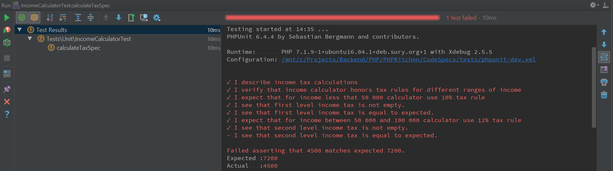

Code Specs is a PHPUnit plugin for BDD style Unit tests that allows to writes test in a specification way using human-readable format. 
Goal of this library is to add a bunch of cool methods for unit testing and show a way of representing unit tests as a behavior specifications of a specific class and a test of specific method as a specification of the method.
Tester represents an actor who test you code(yes, like in [Codeception](https://github.com/Codeception/Codeception) - because of Codeception this library exists). See by yourself:
```php
namespace Tests\Unit;

use PHPKitchen\CodeSpecs\Base\Specification;
use PHPKitchen\CodeSpecsCore\Contract\TestGuy;

/**
 * Specification of {@link IncomeCalculator}
 *
 * @author Dmitry Kolodko <prowwid@gmail.com>
 */
class IncomeCalculatorTest extends Specification {
    private const EXPECTED_TAX_FOR_FIRST_LEVEL_TAX_RULE = 4500;
    private const EXPECTED_TAX_FOR_SECOND_LEVEL_TAX_RULE = 7200;
    private const EXPECTED_TAX_FOR_THIRD_LEVEL_TAX_RULE = 30000;
    private const EXPECTED_INCOME = 300000;

    /**
     * @test
     */
    public function calculateTaxSpec() {
        $clientsPayments = []; // dummy variable, just for example
        $hoursSpentWorking = 160; // dummy variable, just for example
        $service = new IncomeCalculator($clientsPayments, $hoursSpentWorking);
        $I = $this->tester;
        $I->describe('income tax calculations');

        $I->verifyThat('income calculator honors tax rules for different ranges of income', function (TestGuy $I) use ($service) {

            $I->expectThat('for income less that 50 000 calculator use 10% tax rule');
            $I->lookAt('first level income tax');
            $I->seeNumber($service->calculateTax())
                ->isNotEmpty()
                ->isEqualTo(self::EXPECTED_TAX_FOR_FIRST_LEVEL_TAX_RULE);

            $I->expectThat('for income between 50 000 and 100 000 calculator use 12% tax rule');
            $I->lookAt('second level income tax');
            $I->seeNumber($service->calculateTax())
                ->isNotEmpty()
                ->isEqualTo(self::EXPECTED_TAX_FOR_SECOND_LEVEL_TAX_RULE);

            $I->expectThat('for income more than 100 000 calculator use 20% tax rule');
            $I->lookAt('third level income tax');
            $I->seeNumber('income tax', $service->calculateTax())
                ->isNotEmpty()
                ->isEqualTo(self::EXPECTED_TAX_FOR_THIRD_LEVEL_TAX_RULE);
        });
    }

    /**
     * @test
     */
    public function calculateWithTaxSpec() {
        $clientsPayments = []; // dummy variable, just for example
        $hoursSpentWorking = 160; // dummy variable, just for example
        $service = new IncomeCalculator($clientsPayments, $hoursSpentWorking);

        $I = $this->tester;
        $I->describe('income calculation');

        $I->lookAt('income tax');

        $I->expectThat('calculator calculates income with tax using 10% tax rule for income less that 50 000');

        $I->seeNumber($service->calculateWithTax())
            ->isNotEmpty()
            ->isEqualTo(self::EXPECTED_INCOME);
    }
}
```

CodeSpecs also decorates errors output so, for example, if "IncomeCalculator" service from example above will incorrectly calculate income the error output will include following message(example of output in PHPStorm):



Documentation contains following paragraphs:
* [Installation](en/installation.md)
* [Getting started](en/getting-started.md)
* [Directives](en/directives.md)
* [Runtime matchers](en/runtime-matchers.md)
* [Examples](en/examples-list.md)